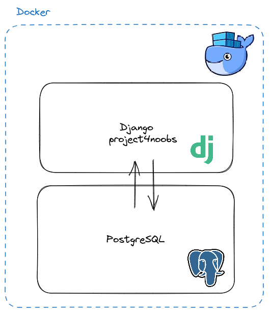

## 1.0 Dockerizando o Django

Em um cenário profissional, é importante que o seu projeto seja reprodusivel em diversos ambientes como: desenvolvimento, homologação, QA e produção.

Desta forma, a utilização do [Docker](https://docs.docker.com/get-docker/) é uma boa alternativa para solucionar este problema. Garantindo que as mesmas bibliotecas e funcionalidades sejam instaladas corretamente em seu devido ambiente.

Neste tutorial vamos aprender de maneira básica como configurar o Docker para trabalhar com o Django + PostgreSQL como nosso banco de dados. Caro leitor, não se preocupe, nosso ponto de partida será com o `projeto4noobs` que você desenvolveu anteriormente.

### 1.1 Ferramentas que vamos utilizar

- Docker
- Docker Compose

### 1.2 A estrutura do projeto

Nesse projeto utilizaremos o docker compose para fazer a orquestração dos containers. Teremos dois containers um responsável pela aplicação e outro pelo nosso banco de dados.

<h1 align="center">
    
</h1>

### 1.3 Containerizando nosso projeto

#### 1.3.1 Levantando nossas dependências

Quando estamos dockerizando qualquer projeto, é importante que todos os desenvolvedores possuem as mesmas dependências e bibliotecas.
Pensando nisso, vamos criar um arquivo chamado `requirements.txt` no nosso projeto, e neste arquivo colocaremos as seguintes dependências:

```bash
Django==4.2
psycopg2==2.9.9
```

Estas dependências irão ser instaladas automaticamente posteriormente pelo nosso container.
Contudo esse arquivo pode ser importante mesmo fora do ambiente docker, podemos ter as mesmas dependências de bibliotecas Python com o seguinte comando:

```bash
pip install -r requirements.txt
```

#### 1.3.2 Gerenciando variáveis de ambiente

#### 1.3.3 Criando nosso Dockerfile

#### 1.3.4 Criando nosso docker-compose
